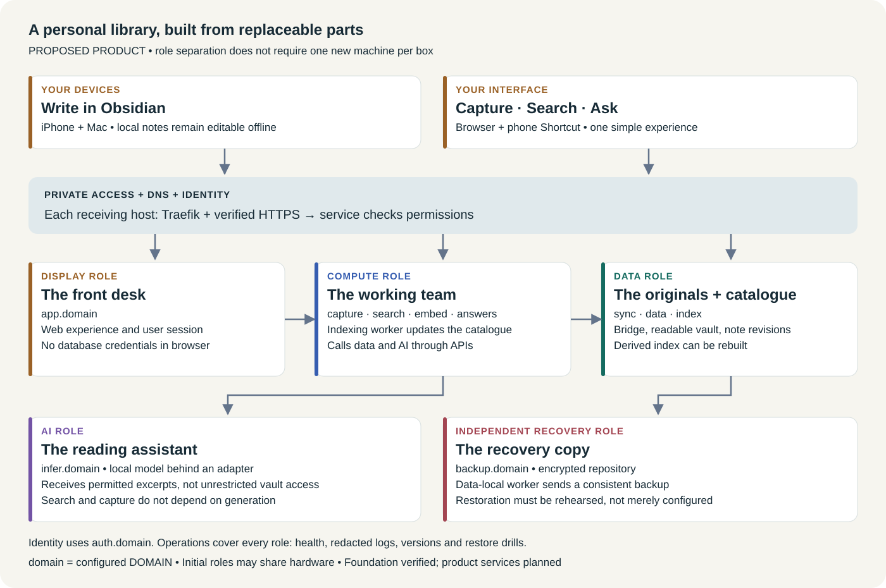
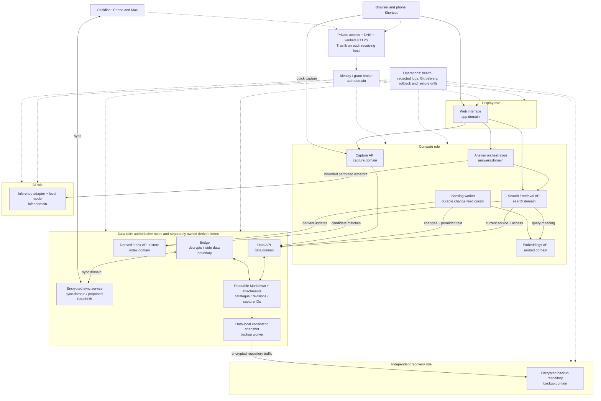

# Calicortado

## Your thoughts, kept useful

A proposal for a private personal library that remembers what you saved, helps you find it, and answers questions with sources.

**Proposal snapshot: 29 September 2026.** The product direction is confirmed. The foundation and isolated routing tests are complete; the note, search and AI product is not yet running. This document explains the intended first release and the evidence behind our progress. It is not a delivery-date or performance guarantee.

## 1. The problem worth solving

A useful idea can arrive anywhere: while walking, reading, planning a project or talking to someone. Saving it is only half the job. Weeks later, you need to remember that it exists, find the right version and understand why it mattered.

Calicortado aims to make that cycle simple: **capture → keep → find → understand**. Write without having to design a filing system first. Keep notes in a format you can take elsewhere. Search by words or meaning. Ask a question and get an answer connected to the notes it came from.

The intended first user is someone who writes on an iPhone and Mac and wants control over their information. Shared household use is a later expansion, not part of the initial rollout.

## 2. The pitch in one minute

Imagine a personal library. Obsidian is your notebook. Sync delivers edits between your devices. The data service is the librarian responsible for the originals. Search is the catalogue. AI is a reading assistant that works with relevant excerpts. Backup is a separate recovery copy kept somewhere else.

You interact with two familiar surfaces: **Obsidian for writing and editing**, and a **Calicortado website for Capture, Search and Ask**. A phone Shortcut is planned for quick capture. The supporting machinery stays behind those surfaces.

The proposed benefit is continuity: losing access to AI should not stop you writing or searching. Replacing the website should not require moving your notes. Moving AI to another machine should not require rebuilding the whole product.

### A day with the finished first release

| Moment | What you do | What the product should do |
|---|---|---|
| An idea arrives | Capture a short thought on your phone | Preserve the text and show whether it was saved or is waiting to send |
| You have no signal | Keep writing in Obsidian | Store edits locally and sync when connectivity returns |
| You return to your Mac | Open your notes | Bring the devices up to date, with conflicts handled visibly |
| You vaguely remember something | Search “ideas for a quiet workspace” | Find relevant permitted notes, even when the wording differs |
| You need a decision recap | Ask “Why did I choose this approach?” | Retrieve relevant notes and provide an answer with source links, or say the evidence is insufficient |
| A machine fails | Follow the recovery procedure | Restore notes and the service state needed to use them again |

These are intended experiences. They still require implementation and real-device acceptance.

## 3. The architecture at a glance

**Read the picture from top to bottom.** Devices reach services through private access and named HTTPS entrances. Each machine has its own Traefik entrance. The coloured groups are responsibilities that can move independently; they are not a demand to buy one machine per box. The arrows show the major journeys. The full service-to-service flow appears in section 6.

Every service address uses the configured `DOMAIN`, such as `data.<domain>`. A domain is a stable name, like a department's telephone number. DNS is the directory that finds its current machine. Traefik is the receptionist on that machine that sends the request to the right service. HTTPS protects the connection. The service must still check who is asking and what they are allowed to do.

There is **no mandatory central proxy** through which every request must pass. Each destination has its own ingress. A private address is not automatically a public website, and knowing an address does not grant access.

## 4. What each part does

| Part and address | Plain-language job | Technology and responsibility |
|---|---|---|
| Obsidian on iPhone/Mac | Your everyday notebook | Local Markdown files; device setup belongs to the user |
| Display — `app.<domain>` | The front desk | Planned responsive Capture/Search/Ask web interface; no database or machine credentials in the browser |
| Identity — `auth.<domain>` | Checks your library card | Human, device and service identities; a broker/session adapter issues narrowly scoped permissions. Integration with existing identity is still to be proved |
| Sync — `sync.<domain>` | Delivers edits between notebooks | Proposed Obsidian LiveSync and CouchDB combination; pinned-version compatibility, encryption and iPhone behaviour need a prototype |
| Bridge and data — `data.<domain>` | Keeps the originals and records changes | Bridge maintains the local readable vault; data API owns note IDs, versions, change history and retry-safe capture records |
| Capture — `capture.<domain>` | Accepts a new thought | Validates input and asks the data API to save it; retrying one capture must not create duplicates |
| Index — `index.<domain>` | Stores the searchable catalogue | Derived word/vector index with its own API and permissions; rebuildable from the authoritative notes |
| Embeddings — `embed.<domain>` | Describes meaning as numbers | Proposed CPU model converts text into vectors; model choice and measured quality remain open |
| Search — `search.<domain>` | Finds useful pages | Retrieval combines permitted source content and index results; checks current access before returning snippets |
| Indexing worker | Updates the catalogue | Reads the data change feed, breaks text into passages, calls embeddings and updates the index through their domain APIs |
| Inference — `infer.<domain>` | Runs the language model | Local model runtime behind a small adapter, likely on the GPU host; model fit and availability require measurement |
| Answers — `answers.<domain>` | Assembles a sourced response | Calls search, gives permitted excerpts to inference, and validates citations and current access |
| Backup — `backup.<domain>` | Keeps an independent recovery copy | Proposed restic repository through an authenticated HTTPS endpoint; protocol, retention and restore targets remain decisions to verify |
| Operations | Keeps the library maintainable | Health checks, redacted diagnostic records, versioned deployment, rollback instructions and recovery drills |

The indexing worker and data-local backup worker are workers, not extra public endpoints. Existing infrastructure includes private DNS, per-node Traefik and identity facilities; that does not mean the new product integrations are complete.

## 5. Separate parts, one product

The design has independently deployable **display, data, compute, AI and recovery roles**. Display can live on a small web host, data on reliable storage, compute on a general-purpose server, AI on a GPU machine and recovery on an independent destination. Some roles may initially share hardware.

An **API** is a service's agreed order form: what you can ask for, which details you must provide and what comes back. OpenAPI files describe these forms precisely so different parts can be implemented and checked independently.

Every cross-layer call uses its configured domain through Traefik, including calls between services that happen to share a machine. Services do not borrow another layer's folder, connect directly to its database or assume that sharing a network makes them trustworthy. Storage access inside its owning component is allowed; the bridge and data service work together inside the data boundary.

To move a service, an operator deploys its compatible implementation on the new host, moves its state where necessary, verifies access and certificates, and changes routing/DNS or its endpoint override. Callers keep the same API. **Moving a name alone does not move the underlying data.** A later release test must demonstrate this across separate machines or isolated virtual machines.

`DOMAIN` supplies the default naming scheme. A per-service override can point one layer elsewhere without changing application logic. These are configuration choices, not private addresses embedded in source code.

## 6. The complete logical request flow

[Open the full service-flow diagram](architecture-flow.svg) separately for zooming. The [HTML reading copy](proposal.html) embeds both diagrams and includes a print stylesheet. Rebuild the reading copy and diagrams with `python tools/build-proposal.py` from the repository root after editing this guide or its diagram generator.

This is the proposed full product, not a diagram of currently deployed services. A box with a domain denotes that service behind its destination's Traefik. Solid arrows are requests or local data operations; dotted arrows show shared access and operational responsibilities. Responses return over the same connection. Identity enforcement applies to every protected destination; it is drawn once to keep the picture readable.

The diagram shows the selected data-local backup-worker design. A remote backup consumer would instead use the scoped data export API; it would not mount the vault. Sync has its own supported client authentication; it must not be forced through an incompatible browser login flow.

### Journey A: save a thought

The phone gives a capture a unique receipt number before sending it. Capture checks the request; data saves the note and receipt together with crash recovery. If the connection fails and the phone tries again, the same receipt identifies the same capture. The bridge then sends the note into device sync. “Saved on the server” and “arrived on every device” are separate statuses.

### Journey B: find a note

The indexing worker learns which notes changed and updates a searchable catalogue. An embedding is a numerical description that helps compare meaning; it is not a reliable compressed copy of the original. Search uses that catalogue to find candidates, then checks the authoritative data and permissions before releasing results. Deletions and privacy exclusions must propagate; a stale index must not expose a newly forbidden note.

### Journey C: ask a question

Answers asks search for relevant permitted passages. It sends a bounded selection to the local language model, then checks the response's source references before returning it. This is often called **retrieval-augmented generation**, or RAG: look up evidence first, then write an answer from it. The model is not being trained on the whole vault for each question. Citations make checking easier; they do not guarantee correctness. The first release gives AI no authority to edit notes or run administrative actions.

## 7. Privacy explained honestly

**Private does not mean nobody can ever read the data.** The proposed sync path encrypts note content, but the bridge must decrypt it inside the data component so search can work. That machine holds readable notes and relevant encryption material. The AI runtime also processes the selected readable excerpts supplied for a question. Those hosts and their operators are inside the trust boundary.

Human login, phone credentials and service credentials serve different purposes. The chosen contract design uses bounded grants: permission for a particular destination and action, checked through an identity service. “You may create a capture” does not mean “you may browse every note.” The live identity implementation still needs interoperability and revocation tests.

Routine logs should record status, timing and request identifiers rather than note text, prompts or secrets. Notes can be excluded from indexing. Backups need separate encryption-key custody and a restore procedure that still works if the original host is lost.

The proposed generation path uses a local model with no automatic cloud-model fallback. This is not a promise of zero external dependencies: certificate issuance, software downloads and the selected private-access service may still depend on external providers. No cloud inference, autonomous action agent or public exposure of backend databases is included in v0.1.

## 8. What happens when something breaks?

| Failure | Intended user experience | Important limit |
|---|---|---|
| Phone loses connectivity | Keep editing locally; sync later | Newly saved server notes cannot reach the disconnected phone yet |
| AI machine sleeps | Capture and direct search remain usable | Ask reports unavailable; no automatic wake or cloud fallback |
| Website stops | Obsidian remains an independent editor | Web Capture/Search/Ask are unavailable |
| Data service stops | Local editing continues and unsent captures stay visible | Search cannot reveal stale snippets whose current access cannot be checked |
| Sync bridge stops | Devices retain their local notes | Server mirror freshness and delivery must be reported honestly |
| Identity service stops | Local notes stay usable | New protected requests fail closed rather than bypassing login |
| Backup destination stops | Live work can continue with an alert | Recovery coverage is reduced until backup succeeds again |

**Sync is delivery; backup is recovery.** Sync can carry an accidental deletion to other devices. An independent, tested backup is needed to go back to an earlier recoverable state. A successful “backup completed” message is insufficient: we must restore into an isolated environment and verify notes, permissions, identities and a fresh sync client.

## 9. What exists today

| Evidence as of 29 September 2026 | What it proves | What it does not prove |
|---|---|---|
| 12 component epics, 50 stories and eight proposed sprint goals | Work has defined outcomes, dependencies and acceptance gates | A fixed completion date or a finished product |
| E01 complete: scope, inventory, tooling and seven API contracts | A checked foundation for implementation | Running note or AI services |
| 23 application tests and 36 schema fixtures passing | Configuration and contract rules behave in those offline tests | Real devices, production authentication or recovery |
| Seven disposable HTTPS/authentication checks passed; cleanup verified | Local routing, rejection cases and a configuration-driven backend switch | Cross-machine DNS relocation or production identity |
| Five infrastructure preparation tests and two Compose phase validations passed | Reviewed source can describe a one-name move and fail on missing settings | Live rollout, certificate issuance or DNS convergence |
| Selected live DNS/router settings inspected read-only | No matching proposed-name conflicts in those inspected settings | Complete zone ownership or readiness on every host |

CAL-005 remains In progress. The live test is prepared and awaits the requested authorization and operator-owned privileged DNS steps. Notes, capture, sync, recovery, search, AI answers and the website still need implementation and acceptance. The temporary BasicAuth test is not the intended final identity system.

## 10. The route to a usable release

| Stage | Demonstration the user should see | Gate before moving on |
|---|---|---|
| S0 — Foundation | Clear scope and compatible component contracts | Completed offline |
| S1 — Secure connections and sync feasibility | Authenticated domains and a disposable iPhone/Mac sync prototype | Real TLS, denied access and sync/bridge compatibility |
| S2 — Reliable capture and data | Save a note, retry safely, edit it and see it sync | Durability, conflict handling and device evidence |
| S3 — Recovery and private remote use | Restore from scratch and capture away from home | Independent recovery and verified remote access |
| S4 — Search | Find useful current notes by words and meaning | Relevance, freshness and permission tests |
| S5 — Grounded answers | Ask a question and inspect its sources | Measured model fit, evidence quality and outage handling |
| S6 — Unified display | A coherent Capture/Search/Ask experience | Real service integration and usability |
| S7 — Release rehearsal | Separate-machine deployment, relocation and full recovery | Real user trial, operational documentation and release review |

The backlog proposes two-week sprint planning windows; eight windows are **not a sixteen-week delivery promise**. Capacity, hardware results, compatibility and operator availability affect delivery. Some evidence cannot be accelerated: seven actual daily backup observations, a 14-day capture trial and a day-30 phone-storage check remain release gates unless explicitly revised.

## 11. Success, effort and decisions still ahead

Success means you can save a useful thought without losing it, find it later, inspect the sources behind an answer and recover your library after a machine failure. It also means another operator can maintain the system from the documentation rather than reconstructing a chat history.

Proposed targets include capture in under 10 seconds, foreground sync within 60 seconds, healthy index freshness within five minutes and a 500 MB phone vault-plus-sync budget. These are **targets to measure**, not observed performance. Background iPhone sync is not promised. AI response time, acceptable data loss, recovery time and retention still need measured or owner-selected values.

The proposal reuses existing infrastructure where suitable. It does not establish a cost estimate or authorize new spending. Storage capacity, GPU/model fit, electricity, backup destination, maintenance time and any external-service costs must be checked before making a budget commitment. Modular deployment adds configuration and operations work; the payoff is replaceability and clearer ownership, which must be demonstrated rather than assumed.

The user owns device setup, real-device usability feedback, reserved node sudo and choices about recovery and acceptable availability. Implementation work owns the APIs, integration, tests and documentation. Every consequential decision belongs in the runbook when it is made. Real notes should only be introduced after the relevant privacy, recovery and onboarding gates; development can proceed with synthetic notes.

The immediate proposed increment is the disposable live routing test, then secure sync and the data foundation. Finishing that test would prove one connection pattern—not finish the product. This proposal adds no deployment authorization and does not close any existing story.

## 12. A small technology dictionary

| Term | Think of it as | What it really means here |
|---|---|---|
| Markdown | A notebook you can read without a special brand of pen | Plain text with simple formatting; attachments remain separate files |
| Vault | Your library shelves | A collection of notes and attachments with an owner and access boundary |
| DNS | An address directory | Maps service names to the relevant ingress machine |
| Traefik / reverse proxy | A receptionist | Routes incoming requests to the intended backend; not a replacement for service authorization |
| TLS / HTTPS | A protected delivery envelope | Encrypts a connection and verifies the named server through certificates |
| API / OpenAPI | An order form and its specification | Defines requests, responses, permissions and error behaviour between components |
| Container / Docker Compose | A packaged appliance and its installation list | Describes service processes, networks and settings; deployment still needs secure operations |
| Embedding / vector | Coordinates in a rough map of meaning | Numbers used for similarity; not an answer or a privacy guarantee |
| Index | A library catalogue | Derived lookup data that can be rebuilt; not the authoritative note collection |
| Inference | Asking a model to write now | Running the language model on supplied input; different from training it |
| Scoped grant | A key that opens only certain doors | Permission limited to a destination, action and relevant user/vault context |
| Idempotency | One receipt, one purchase | Repeating the same capture request does not create another note |
| RPO / RTO | How much you can lose / how long you can wait | Acceptable recovery point and recovery time; still to be agreed and tested |
| Git / runbook / Vikunja | History / instructions / work board | Versioned changes, decisions and evidence, and the current delivery tasks |

## Continue reading

- [Architecture source of truth](../projects/second-brain.md): ownership, trust boundaries and detailed request contracts.
- [Release scope](release-scope.md): confirmed requirements, exclusions and proposed targets.
- [Delivery plan](../plan.md): component epics, stories, dependencies and acceptance gates.
- [Current map](../map.md) and [decision runbook](../runbook.md): progress, reasons and the next action.
- [Security](security.md), [endpoint operations](operations/endpoints.md) and [recovery design](../projects/recoverability.md): supporting requirements and remaining checks.
- [E01 evidence](acceptance/e01.md): what the completed foundation actually demonstrates.

This guide translates those project records for a wider audience. If a summary becomes stale, the owning architecture, backlog and dated evidence govern; update this proposal with the same change.
