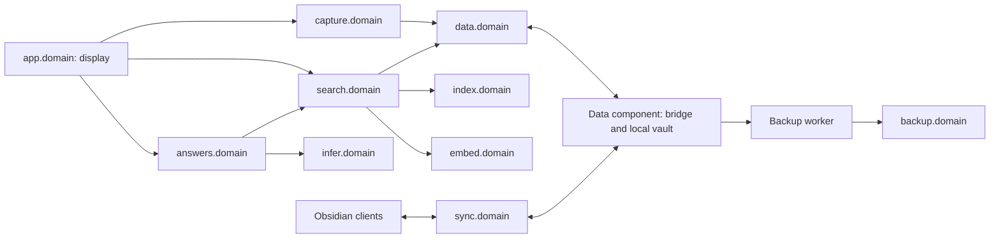

# Calicortado component map

Last reviewed: 2026-09-29. E01 is completed as an offline foundation; other components remain planned, not verified deployments. [plan.md](plan.md) owns the 50-story backlog and eight sprint goals. [E01 evidence](docs/acceptance/e01.md) records checks and limits.

## Domain boundaries

Every named domain passes through Traefik. Local mirror access is confined to the data component. Authentication, access rules and DNS dependencies are specified in the [architecture](projects/second-brain.md); the diagram omits those edges for readability.

## Component ownership

| Epic | Component | Sprint allocation | Current state / next output |
|---|---|---|---|
| CAL-E01 | Foundation and contracts | S0 | Complete locally: scope, inventory, offline workspace and validated contracts; no deployment |
| CAL-E02 | Traefik edge and identity | S1 | In progress: registry and local ingress rehearsal verified; live DNS/relocation and identity gates remain |
| CAL-E03 | Vault sync and data service | S1–S2 | Planned: sync prototype, persistent vault and HTTP data boundary |
| CAL-E04 | Capture clients and ingestion | S2 | Planned: iPhone/Mac capture and idempotent API/fallback |
| CAL-E05 | Backup and recovery | S3 | Planned: independent domain endpoint and full restore |
| CAL-E06 | Private remote access | S3 | Planned: chosen transport, allowed routes and device tests |
| CAL-E07 | Embedding service | S4 | Planned: CPU embedding domain and model compatibility |
| CAL-E08 | Retrieval and index | S4 | Planned: index data API, change-feed consumer and private search |
| CAL-E09 | Local inference | S5 | Planned: model fit, authenticated inference and bounded failures |
| CAL-E10 | Grounded answers | S5 | Planned: citations, streaming and evidence-based evaluation |
| CAL-E11 | Display | S6 | Planned: independently hosted responsive Capture/Search/Ask interface |
| CAL-E12 | Operations and release | S1, S7 | Planned: early observability, distributed test and release acceptance |

## Proposed host roles

Data/sync/index, general compute, AI, display and backup are distinct placement roles. Initial candidates are data-compute-host for data/compute, inference-host for inference and backup-host for backup; CAL-002 records observations and the verification still needed before deployment. Display has no fixed host requirement.

CAL-002 recorded readiness gaps; private host details have since been removed. Inference access and independent backup storage still require verification in the target environment. [Environment requirements](docs/operations/environment.md) define those gates. Domains derive from DOMAIN; [per-layer overrides](docs/development.md#domain-configuration) preserve relocation without code changes.

CAL-047 proves data, compute, AI and display on separate authorized machines or isolated VMs. Moving a layer changes endpoint configuration/DNS/ingress, not consumer application code.

## Delivery gates

Contracts → private domains/identity → sync/data/capture → recovery/remote → embeddings/search → inference/answers → display → distributed release.

Client capture remains independent of inference. Search must work while inference is stopped. Backup has its own failure signal and independent storage. Observation windows and explicit owner decisions remain real gates.

## Next action

CAL-005 remains In progress. The [endpoint registry](docs/operations/endpoints.md) records initial placements and the per-node Traefik/DNS procedure. Read-only inspection of both DNS container settings and application/compute file-provider rules found no candidate-prefix collision. Other target nodes/manual overrides and live multi-network resolution remain unchecked.

The infrastructure-owned disposable HTTPS fixture passed seven checks, including denied authentication, certificate trust and a backend switch with the same client. Cleanup passed. This local test uses temporary BasicAuth and an explicit proxy restart; it does not close production identity, DNS relocation or firewall gates. Infrastructure source now matches its remote; inactive two-phase live probe candidates and operator rollback instructions are prepared and validated. Node checkouts lag newer unrelated changes, so rollout uses targeted DNS refresh and preserves existing files. Await the requested live-change authorization and operator sudo steps before enabling the probe. Inference ingress and backup recovery retain their separate readiness gates.

The imported 62-task project is mapped. CAL-001–004 and CAL-E01 are verified Done with execution evidence; CAL-005 is verified in the In progress column. Private live IDs and credentials stay in ignored local state. Preserve the existing project; do not re-import the backlog.

The initial sanitized source baseline was committed and pushed to the user-supplied remote on 2026-09-28. Source and private inventory remain separate. All live DNS/TLS changes follow the access matrix and infrastructure Git workflow.
