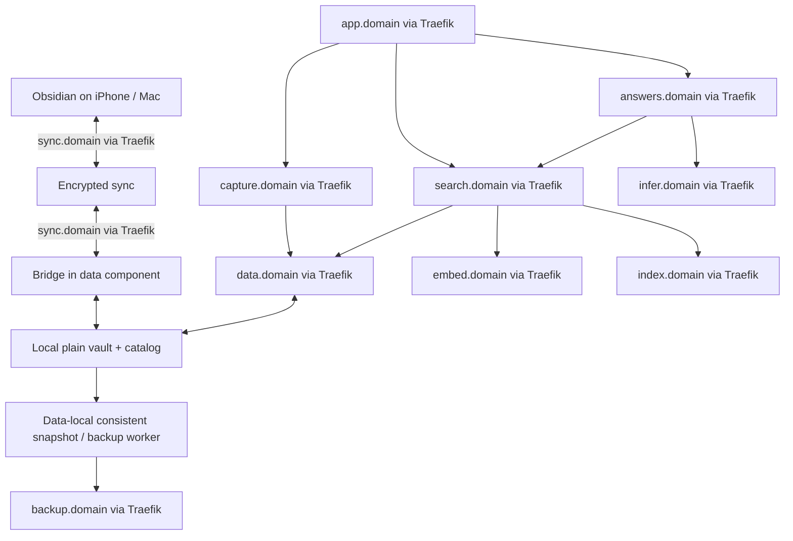

# Calicortado modular architecture

For an illustrated introduction before the technical specification, read the [proposal and technology guide](../docs/proposal.md). This document remains the architecture source of truth.

Status: E01 contract baseline, 2026-09-27. Separately deployable layers and individual domains behind Traefik are confirmed requirements. Product shape and the environment-configured DOMAIN are user-confirmed; host placements and live identity/TLS integration remain later-story gates. See [contracts](../docs/contracts.md), [security](../docs/security.md) and [environment](../docs/operations/environment.md).

[plan.md](../plan.md) contains the component epics, 50 implementation stories and acceptance gates. No services described here are claimed to be built.

## Product boundary

Confirmed baseline: Obsidian is the iPhone/Mac offline editor. Calicortado supplies self-hosted sync, capture, recoverability, private remote access, retrieval, local answers and a web display. The user handles device setup; a custom native editor is outside v0.1.

The first complete release includes both direct search and AI answers. AI runtime availability is conditional on its host; ordinary note capture, editing and direct search do not depend on generation. Shared household rollout and automated reviews are later features.

## Layers and ownership

| Layer / epic | Owns | Must not own | Replaceability |
|---|---|---|---|
| Edge and identity / E02 | TLS ingress, private routing, identity validation and service access policy | Note data or model authorization decisions | Domain and credential contracts remain stable across ingress hosts |
| Data / E03 and E08 storage story | Sync database, bridge mirror, note IDs/revisions/change feed, capture deduplication, recovery exports; separately owned derived index store | Embedding/generation logic or presentation | Move persistent stores with their APIs; consumers never see storage paths |
| Capture / E04 | Input validation and create-only ingestion orchestration | Vault filesystem or independent source of truth | Stateless API; all durable identity/state stays in data |
| Backup / E05 | Independent encrypted repository and restore procedures | Live editing/sync authority | Supported repository endpoint behind its own Traefik domain |
| Embeddings / E07 | Pinned CPU model, bounded vector generation | Note storage or user policy | Replace host/model via versioned API; model change requires index generation |
| Retrieval / E08 | Change-feed indexing, chunking, ranking orchestration and freshness checks | Raw database connections or mirror mounts | Calls data, embeddings and index APIs through domain URLs |
| Inference / E09 | Local model runtime, bounded generation and minimal adapter | User vault access or infrastructure actions | Separate GPU host; generation contract hides runtime placement |
| Answers / E10 | Authorized retrieval, prompt construction, citations and generation orchestration | Persistent notes or write/admin tools | Stateless service calls search and inference domains |
| Display / E11 | Responsive Capture/Search/Ask interface and human session flow | Database/model credentials or raw host knowledge | Independent web host; backend endpoints are configuration |
| Operations / E12 | Health, redacted tracing, upgrade/restore/portability evidence | A new store of private note contents | Shared operational contracts and documented per-component ownership |

Keep implementations small: these are process/API boundaries where needed, not a requirement for Kubernetes, a message broker or a full microservice framework. The embedding, retrieval and answer services may initially share a compute host while retaining separate credentials, contracts and deployment packages.

## Domain register

Prefixes below are candidates pending CAL-005 collision checks. `<domain>` means the runtime `DOMAIN` environment variable, set by the deployment environment. Derive DNS/Traefik/TLS and service defaults from that value; never embed it in application logic. Per-service base URL overrides allow independent placement or domains. See the [endpoint template](../config/deployment.example.json) and [configuration instructions](../docs/development.md#domain-configuration). A hostname/certificate does not make a service public. Every cross-layer request uses the receiver's domain through Traefik, even when layers currently share a machine.

| Address | Protocol and interface | Authorized callers | Endpoint configuration |
|---|---|---|---|
| `https://app.<domain>` | Web display | Signed-in user on LAN/private remote path | Public-facing app base URL, privately reachable |
| `https://auth.<domain>` | Human identity/session or existing identity-provider routes | User login and authorized identity clients | `IDENTITY_BASE_URL` |
| `https://sync.<domain>` | CouchDB/LiveSync protocol, separate from custom REST contracts | Registered Obsidian clients and bridge | `SYNC_BASE_URL` |
| `https://data.<domain>` | Versioned note catalog/content/changes/create/export API | Scoped capture, indexer, retrieval and backup identities | `DATA_BASE_URL` |
| `https://capture.<domain>` | Create-only `/v1/captures` | Registered device token or signed-in display user | `CAPTURE_BASE_URL` |
| `https://index.<domain>` | Derived-index upsert/delete/query API | Separate index-writer and query identities | `INDEX_BASE_URL` |
| `https://embed.<domain>` | `/v1/embeddings` | Indexer/retrieval service identities | `EMBEDDING_BASE_URL` |
| `https://search.<domain>` | `/v1/search`, authorized snippets/source links | Signed-in display and delegated answer requests | `SEARCH_BASE_URL` |
| `https://infer.<domain>` | Contracted generation/stream operations | Answer service identity only | `INFERENCE_BASE_URL` |
| `https://answers.<domain>` | `/v1/answers`, cancellation/stream contract | Signed-in display | `ANSWERS_BASE_URL` |
| `https://backup.<domain>` | Selected supported repository protocol, proposed restic REST over HTTPS | Backup writer and separately privileged restore/maintenance identities | `BACKUP_REPOSITORY_URL` |

Health endpoints belong to each component's domain, restricted to authorized probes. Administrator operations are not exposed on ordinary user/API routes. Do not add health/control routes to a third-party protocol unless the selected component supports them; probe the appropriate documented operation instead.

The data layer's CouchDB, mirror metadata store and derived database are internal implementation details. A local backend socket within a component is permitted. Raw database TCP between layers is not the design. If a future requirement needs a separate raw database host, either move its owning API with it or record a dedicated authenticated Traefik TCP/TLS contract; do not treat a SQL protocol as an HTTP route.

## Proposed placement

| Host role | Initial candidate, subject to inventory | Components |
|---|---|---|
| Data host | data-compute-host initially, independently movable to another suitable host | Sync, bridge, data API, derived index API/storage |
| Compute host | data-compute-host initially; separate worker in portability test | Capture, embeddings, retrieval, answers |
| AI host | inference-host | Inference adapter/runtime |
| Display host | Any authorized small host | Web display and any session adapter required by the identity design |
| Recovery host | backup-host, only after destination verification | Backup repository behind local Traefik |
| Access/identity hosts | Existing suitable infrastructure | Private transport, DNS and identity |

No dependency on a particular host name belongs in application logic. Record resolved placement only after inspection. Shared initial placement does not waive the separate-machine acceptance test in CAL-047.

## Request paths

The bridge and data API share storage only inside the data component. A remote retrieval, AI, display or backup consumer may not mount that directory. A data-local backup worker can snapshot it and send encrypted repository traffic to the backup domain; an independent backup consumer instead calls the scoped export API.

### Capture and sync

1. A Shortcut creates a capture identity before attempting an online write.
2. Capture API validates device/user scope, size and content, then calls the data domain.
3. Data service atomically publishes an inbox file and durable idempotency state, with recovery for crashes between those operations.
4. Bridge propagates the file through the sync domain; client sync status is distinct from durable server capture status.
5. After ambiguous timeout, local fallback retains the same capture identity. Reconciliation merges representations of that one capture rather than inventing a new one.
6. Edits in Obsidian arrive through the bridge; the data catalog assigns durable revisions/change events without silently altering human text.

### Index and search

1. Indexer resumes an authenticated change-feed cursor from the data domain.
2. It receives only indexable notes within its explicit vault scope.
3. It fetches permitted content, chunks/hashes it, calls the embedding domain, and writes to the index domain.
4. It checkpoints only after durable batch completion; tombstones remove deleted/excluded content.
5. Search embeds the query and queries the index domain, or uses a documented lexical-only degraded path.
6. Before releasing snippets, search revalidates current revision, permission and indexability against the data domain. A stale index must not disclose a now-deleted or excluded note.

### Answers and display

1. Display submits an authenticated user query to the answer domain.
2. Answer service calls search with validated user context and its own limited service authority.
3. It sends bounded authorized snippets to the inference domain; note text is untrusted evidence.
4. It validates citation identifiers and source permission/currentness before returning an answer.
5. If inference is unavailable, direct search remains available. Generated content never gets note-write authority.

Browser code holds no machine credentials. CAL-004/CAL-007 must settle a supported human-session/delegation design: destination services authenticate user context independently and constrain any service identity. A trusted-looking header or a broad backend credential plus a caller-supplied user ID is insufficient. If the selected IdP cannot provide suitable audience/scoping, implement a narrowly scoped identity adapter before enabling delegation.

## Contract minimum

Every custom API contract in CAL-004 defines:

| Concern | Required rule |
|---|---|
| Transport | HTTPS domain through Traefik; verify certificate and hostname; no insecure verification bypass |
| Identity | Distinguish human/device/service principals; validate intended audience, scope and user-vault authorization |
| Note identity | Stable opaque note ID, vault ID, revision and content hash; path is not an authorization token |
| Events | Durable cursors, sequence/revision, create/update/delete/exclusion, retry-safe delivery and cursor-expiry rescan |
| Create | Capture ID, content hash, bounded text; same ID/body returns same result, different body conflicts |
| Responses | Versioned schemas and structured errors: request ID, error code, retryability; no internal secrets |
| Errors | 401/403 auth; 409 conflicting write; 410 expired cursor where used; 413 oversized input; 429 busy; 503 unavailable, with agreed semantics |
| Cancellation | Propagate request cancellation and bounded deadlines through answers to inference |
| Search | Authorized note ID/revision/snippet/link, ranking metadata and freshness; no-results differs from dependency failure |
| Generation | Model version, bounded context/output, stream lifecycle and explicit unavailable/insufficient-evidence states |
| Compatibility | Additive compatible changes in v1; migrations and breaking versions recorded before rollout |
| Observability | Redacted request IDs, duration, status and version; no raw notes, prompts, tokens or captures in routine logs |

No event broker is required initially. A durable HTTP change feed and rescan contract keep source ownership clear and reduce deployment dependencies. API limits and timeouts become measured values in the relevant stories, not arbitrary unverified guarantees.

## Traefik and security

Use target-local Traefik ingress where practical. Each hostname resolves to its selected ingress. An ingress forwarding across machines must validate upstream TLS and the expected identity; plaintext across a host boundary is not acceptable. Local proxy-to-backend transport is documented and isolated within the component.

Traefik routing, private-network membership and TLS are necessary but do not replace application authorization. Strip untrusted identity headers. Separate human session, sync-client and service credentials. Close direct published ports that bypass policies. Limit browser origins/CSRF appropriately; CORS is not a non-browser access control.

Machine-to-machine routes never depend on browser login redirects. The exact sync-client auth and selected IdP's supported delegation must be tested against pinned versions. No general admin/model-management operation is part of the inference contract.

Backup keys and credentials remain outside source control. Source encryption protects sync transport/storage but the bridge host holds plaintext and the passphrase; confirm that boundary before real data. Keep text archives available offline under the measured phone budget.

## Operations and failure behavior

| Failure | Expected behavior |
|---|---|
| Sync/bridge down | Local notes remain editable; mirror freshness becomes unhealthy; do not claim newly captured notes reached devices |
| Data API down | Local editing continues; API capture retains unsent text; search cannot release unverified stale private snippets |
| Index/embedding down | Indexing resumes from durable state; only explicitly safe degraded search is offered |
| Inference/answer layer down | Direct search still works; Ask reports unavailable without waking a host or calling a cloud model |
| Display down | Obsidian editing/sync and device capture remain independent |
| Identity down | New protected requests fail closed; existing local notes remain accessible on the device |
| Backup target down | Live capture continues; an actionable backup incident exposes loss of coverage |
| Private access down | Local offline capture continues; remote clients catch up when access returns |

Independent versioned packages, manifests, health endpoints, config references and operation guides are required for each deployable component. A new component is not complete until another implementer can start, verify, diagnose, upgrade and roll it back from the guide.

## Documentation ownership

- plan.md: stories, prerequisites and acceptance.
- This document: layer ownership, addresses and trust boundaries.
- design.md: user behavior and privacy.
- projects/recoverability.md and projects/remote-access.md: scoped supporting design.
- runbook.md: every decision, its status, rationale, consequences and evidence.
- Future component READMEs/contracts/operations guides: implementable and observed details, created by their stories.

Infrastructure delivery stays in the separate infrastructure repository; this project links outward to implementation evidence and does not add its name to infrastructure documents. No deployment is implied by the plan.

## Technical reference basis

These references support the routing/protocol choices, not compatibility claims about the uninspected deployment:

- [Traefik router documentation](https://doc.traefik.io/traefik/v3.2/routing/routers/) distinguishes HTTP and TCP routing and TLS handling.
- [restic repository preparation](https://restic.readthedocs.io/en/stable/030_preparing_a_new_repo.html) documents repository backends, including REST; CAL-018 verifies the chosen deployed versions and authentication.

Next action: CAL-001 establishes release scope; CAL-004 turns this proposed contract design into versioned, testable interfaces.
